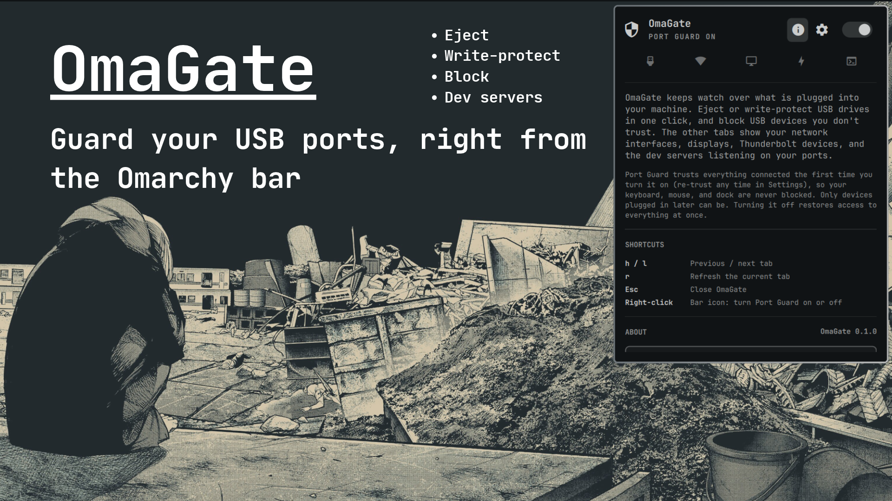

# OmaGate



<sub>Background: Solitude theme wallpaper, bundled with Omarchy.</sub>

A USB port-control bar widget for Omarchy. Eject removable storage,
write-protect it, and deauthorize other hot-pluggable USB devices at the
port, with a hardwired exemption that makes it impossible to lock out
your own keyboard, mouse, or anything else already plugged in.

It follows your Omarchy theme, and there is nothing extra to install:
everything it uses ships with a standard Omarchy system.

## Features

- **Eject**: one-click unmount + power-off for removable storage, no
  password needed.
- **Write-protect**: flip a drive read-only/read-write with a toggle. Its
  mounted filesystems are remounted read-only too (the kernel does not stop
  writes to a filesystem that is already mounted read-write), and if a file
  is open for writing it refuses and changes nothing. It only ever undoes
  its own change: a drive made read-only by something else stays that way.
  Root-only, so it goes through `pkexec` and Omarchy's own themed polkit
  prompt.
- **Block**: deauthorize a hot-pluggable USB device at the port
  (`/sys/bus/usb/devices/<port>/authorized`), instantly disconnecting it
  at the kernel level. Also `pkexec`.
- **Port Guard master switch**: turns the block feature on/off. The first
  time it is turned on it snapshots everything currently connected (retake
  it any time with Settings → Trusted devices → Re-trust); turning it off
  immediately reauthorizes anything it had blocked. This is the panel's
  "get me out of trouble" control, always one click away. Right-clicking the
  bar icon works too.
- Live icon, status text, and device list that reflect real sysfs state, not
  just what was last clicked, so a cancelled prompt or an externally-changed
  device never leaves the panel showing something stale. A udev watcher
  keeps it current even while the panel is closed.
- **Network**: your Wi-Fi and Ethernet interfaces with their addresses.
  Click a row to copy its IP; disconnect or reconnect through
  NetworkManager (no saved connection is changed, so Connect always undoes
  Disconnect).
- **Displays**: connected external monitors, which you can turn off and
  back on. Your built-in screen is never offered, and the last screen that
  is on can never be turned off. It is runtime-only: `monitors.conf` is
  never touched, so a reload, logout, or reboot always brings a display
  back.
- **Thunderbolt**: docks, eGPUs, and drives via `boltctl`, with a
  one-click authorize for this session. There is deliberately no
  deauthorize: a dock can carry your keyboard, mouse, sound, and monitor.
  On a machine without a Thunderbolt/USB4 port the tab says so.
- **Dev ports**: the dev servers you have listening, one row per app:
  JupyterLab and its kernels, Vite, Next.js, Django, and so on, marked
  *Local only* or *Open to network*. Stop your own dev processes (and
  anything they spawned) with a confirm-twice button.
- **Settings**: start tab, auto-refresh interval, which tabs to show,
  new-device notifications, internal USB / virtual interface visibility,
  and dev-port options. Saved to
  `~/.local/state/omarchy/m44f4.omagate/settings.json`.

## Threat model

OmaGate defends against a **hot-plugged USB device** doing something you
didn't want: a rogue flash drive, a "charging" cable that's actually a
BadUSB keystroke injector, a dock left behind after a hotel/conference. It
does **not** replace a persistent allow/deny policy daemon like
[USBGuard](https://usbguard.github.io/) (Omarchy's own
[omarchy-usbguard](https://github.com/Skymebr/omarchy-usbguard) plugin
covers that ground already), and it does not do BadUSB *heuristics*. It's
a manual, one-click deauthorize, not automatic detection.

**Three independent guards** all have to pass before a device is even
offered a block toggle, checked both in the QML (so an ineligible device
never shows a toggle) and again inside `omagate-block.sh` itself (so a
stale UI state, or calling the script by hand, can never bypass them):

1. **Snapshot exemption.** Turning Port Guard on records everything
   currently connected, matched on port *and* USB vendor:product id. Anything
   in that snapshot is permanently exempt. This is what guarantees your
   keyboard, trackpad, webcam, and any already-attached dock can never be
   touched, no matter how the kernel classifies them. Only devices plugged
   in *after* the snapshot was taken are ever block-eligible.
2. **Removable-only.** The sysfs `removable` attribute must read
   `removable`, not `unknown`/`fixed`. Internal, hardwired peripherals never
   qualify.
3. **Non-HID.** A device exposing a HID (`03`) interface is never
   block-eligible, even if the first two guards somehow passed. Defense in
   depth, not the only line of defense.

**Fail-safes on top of that:**

- **Port Guard off = unblock everything**, one click, no exceptions.
- **Non-persistent by design.** The kernel resets `authorized` to its bus
  default on unplug/replug and on reboot. There is no failure mode where a
  crashed or uninstalled OmaGate leaves a device permanently deauthorized.

**What OmaGate doesn't cover:** Thunderbolt/DMA attacks (the Thunderbolt
tab can authorize a device, never block one), BadUSB *detection* (only manual blocking), and
physical security in general: anyone with physical access and enough time
can always open the case. It raises the bar for casual hot-plug abuse; it
isn't a hardware security module.

## Requirements

Nothing to install on a standard Omarchy system. For reference, OmaGate
uses:

- `udisksctl` (eject) and `blockdev` (write-protect)
- `jq` and `python3` (device, network, display, and port listings)
- `pkexec`, with Omarchy's own polkit agent already running in the shell
  (it is by default, so no sudoers setup is needed)
- `ss` (dev ports), `nmcli` (network actions), `hyprctl` (displays)
- `boltctl` (Thunderbolt tab only)
- `wl-copy` (copy buttons) and `notify-send` (optional notifications)

## Install

```bash
omarchy plugin add https://github.com/M44F4/omagate --enable
```

Or manually: clone into `~/.config/omarchy/plugins/m44f4.omagate/` and
enable it from Omarchy's plugin manager. As with any third-party plugin,
read the code before enabling it. None of it is obfuscated, it's plain
bash and QML.

### Root-owned helper (for block and write-protect)

Blocking and write-protect run as root, so OmaGate never runs them from
the plugin folder, which your user account can write to. Instead, install
the helpers once into a root-owned directory (`/usr/local/libexec/omagate`):

```bash
sudo bash ~/.config/omarchy/plugins/m44f4.omagate/bin/omagate-install-helper.sh
```

Run the same command again after updating OmaGate; the panel shows it
whenever the installed helper is missing or out of date, and hides block
and write-protect until then. Everything else works without it.

## Remove

1. Turn Port Guard off first, so anything OmaGate blocked is reauthorized
   (unplugging and replugging a device, or rebooting, also does this).
2. Remove the root-owned helper, if you installed it (this also
   reauthorizes anything OmaGate still has blocked):

   ```bash
   sudo bash ~/.config/omarchy/plugins/m44f4.omagate/bin/omagate-install-helper.sh uninstall
   ```

3. Remove the plugin:

   ```bash
   omarchy plugin remove m44f4.omagate
   ```

4. Optionally delete its saved settings and trusted-device snapshot:

   ```bash
   rm -rf ~/.local/state/omarchy/m44f4.omagate
   ```

Apart from the helper directory above, OmaGate never installs anything
outside its plugin folder and never edits your Omarchy or Hyprland
configuration, so there is nothing else to undo.

## Known limitations

- **Network actions need NetworkManager.** On a system that manages
  Wi-Fi with something else, the network tab still lists interfaces but
  offers no connect/disconnect button.
- **Block is per-port, not per-device-identity.** If you unplug a blocked
  device and plug a *different* device into the same port, the new device
  gets its own fresh eligibility check (it is not automatically blocked or
  trusted based on the port alone). This is intentional, see guard 1 above.
- **No BadUSB detection.** Blocking is always a manual decision you make
  from the device list, never automatic.

## Reporting bugs

[github.com/M44F4/omagate/issues](https://github.com/M44F4/omagate/issues).

## License

MIT. See [LICENSE](LICENSE).
